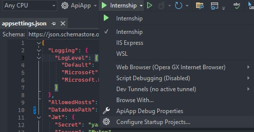
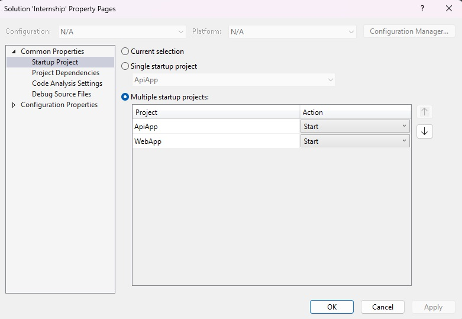
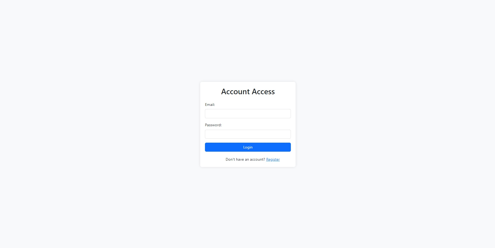
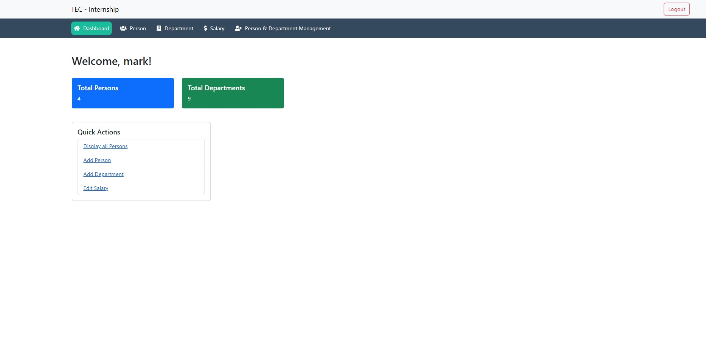
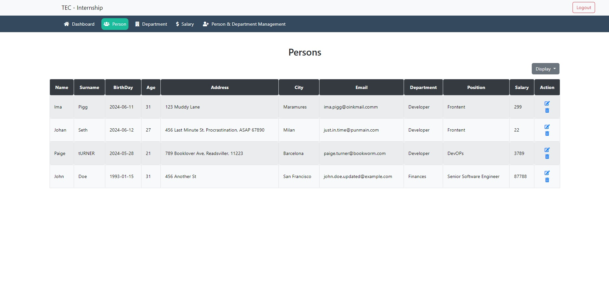
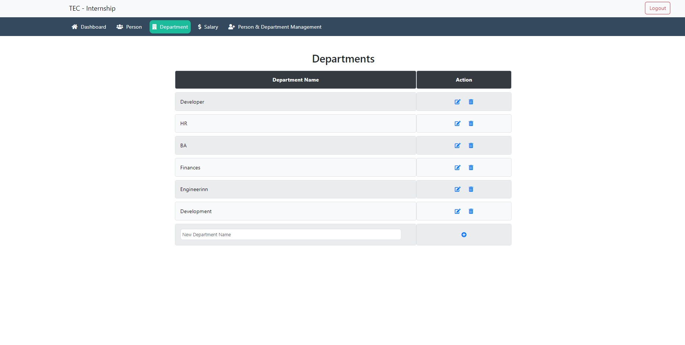
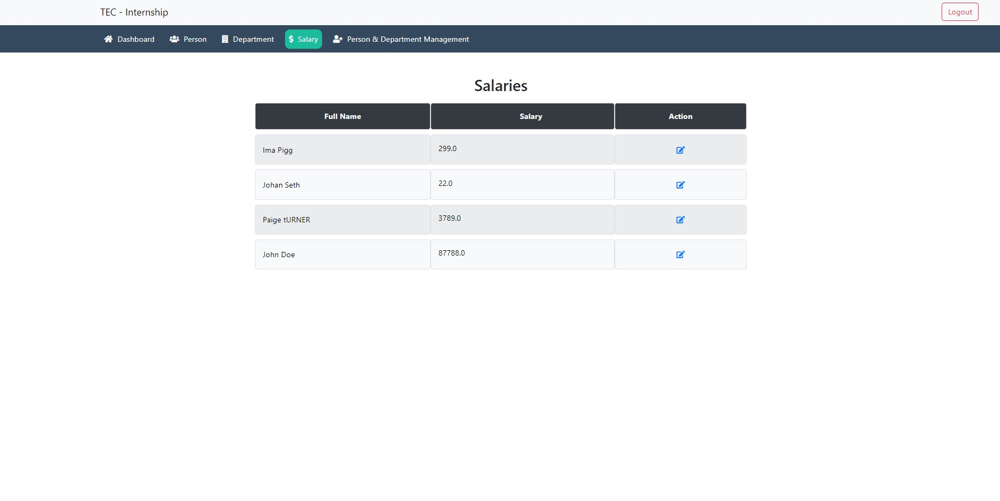
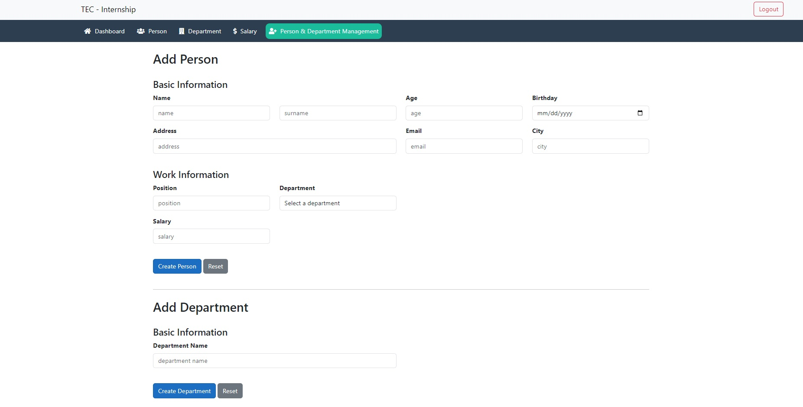

# Web Application

## Introduction

This web application allows you to manage users, departments, and salaries efficiently. With this application, you can:

- Register and authenticate users
- View and manage persons and their details
- View and manage departments
- View and edit salaries

This application provides a user-friendly interface and ensures secure operations using JWT-based authentication.

## Getting Started

### Prerequisites

Before you begin, ensure you have the following installed:

- [.NET Core SDK](https://dotnet.microsoft.com/download)

### Installation

1. Clone the repository:
    ```sh
    git clone https://github.com/cosmindevelops/TEC-Internship-Cosmin-Fuica.git
    cd your-repo-name
    cd TEC-Internship-main
    ```

2. Update the `DatabasePath` in `appsettings.json` from the `ApiApp` project:
    ```json
    {
      "Logging": {
        "LogLevel": {
          "Default": "Debug",
          "Microsoft": "Debug",
          "Microsoft.Hosting.Lifetime": "Information"
        }
      },
      "AllowedHosts": "*",
      "DatabasePath": "C:\\path\\to\\your\\database\\Internship.db",
      "Jwt": {
        "Secret": "ya5Zj6Y2tlfvdyHFai78iV9P4S25CNnpOhO8qBH0v88LGlrYQ5",
        "Issuer": "MyApp",
        "Audience": "MyAppUsers"
      }
    }
    ```

3. Restore the dependencies and run the application:
    ```sh
    cd path/to/ApiApp
    dotnet restore
    ```
    
    ```sh
    cd path/to/WebApp
    dotnet restore
    ```
    
4. Run both applications:
    - Go to "Configure Startup Projects..."

    
    - Select Multiple startup projects
    - Select "Start" for both of the projects

    
    - Apply and Ok
        
## Documentation

For detailed instructions on using the application, refer to the following documentation:

- [API Guide](docs/API.md): Provides details on the API endpoints and how to use them.
- [Usage Guide](docs/USAGE.md): Offers a comprehensive guide on using the web application.

## Base URLs

- **API Application:**
  - Development: `http://localhost:6070`
- **Web Application:**
  - Development: `https://localhost:44315`

## Features

### Authentication

- Register: Create a new user account.
- Login: Access the application with your credentials.

### Dashboard

- View total number of persons and departments.
- Quick action buttons for navigation.

### Person Management

- View all persons: List all users with their details.
- Edit person: Update user details.
- Delete person: Remove a user from the database.
- Create person: Add a new user.

### Department Management

- View all departments: List all departments.
- Edit department: Update department names.
- Delete department: Remove a department.
- Create department: Add a new department.

### Salary Management

- View all salaries: List all users with their salaries.
- Edit salary: Update salary amounts.

### Person & Department Management

- Create person: Fill out a form to add a new user.
- Create department: Fill out a form to add a new department.

## Screenshots


<br>



<br>



<br>



<br>



<br>


